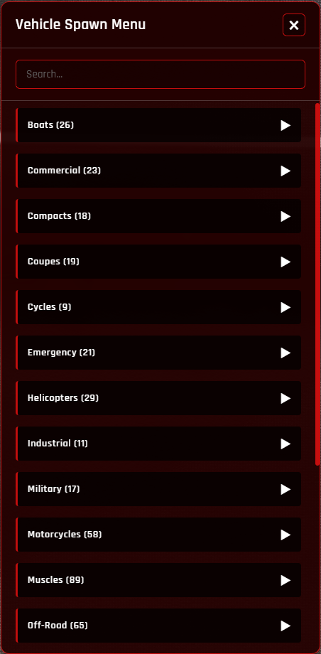

# VEHICLE SPAWN MENU [STANDALONE]

  

## DESCRIPTION

The ultimate vehicle spawn menu for FiveM servers, designed to provide players with an intuitive and highly customizable experience. This standalone script allows instant vehicle spawning with advanced options, perfect for roleplay, testing, or simply enjoying your favorite rides. Give your players full control over their vehicle choices with a sleek, modern interface.

## KEY FEATURES

### **Intuitive NUI Menu**
- A modern and responsive user interface for seamless vehicle selection.
- Easy navigation through categories and search functionality for quick access.

### **Flexible Spawn Options**
- Choose between the script's default robust spawn system or integrate with your server's existing vehicle spawning commands.
- Customize the spawning experience to fit your server's needs.

### **Smart Restrictions**
- Optional safeguards to prevent spawning while driving or if not in the driver's seat, ensuring a smoother experience.
- Enhance server stability by controlling how and when vehicles are spawned.

### **Integrated Notifications**
- Supports `ox_lib` for advanced, customizable notifications or uses default GTA notifications.
- Keep players informed with clear feedback on spawn status, errors, and warnings.

### **Automatic Vehicle Customization**
- Vehicles spawn with predefined visual modifications (e.g., spoiler, performance tuning) for save your time.
- Start driving immediately after spawning car.

## GET NOW

* [DOWNLOAD](https://dking.tebex.io/package/7065811)

## HOW IT WORKS

1.  **Open the Menu**: Use the `/vehiclemenu` command or press `F2` (configurable) to open the interactive vehicle selection menu.
2.  **Browse & Search**: Navigate through vehicle categories or use the search bar to find your desired vehicle.
3.  **Spawn Instantly**: Click on a vehicle to spawn it directly around your character.
4.  **Enjoy**: Get into your new vehicle and drive! The script handles the details, including removing old vehicles and applying basic customizations.

## TECHNICAL DETAILS

- **Standalone Resource**: No external dependencies required (except `ox_lib` for enhanced notifications, which is optional).
- **Highly Configurable**: Extensive options available in `config` folder.
- **Client-Side NUI**: Responsive UI built with HTML, CSS, and JavaScript.

## CONFIGURATION

The script is highly configurable through the `config/config.lua`, `config/notifys.lua` and `config/vehicles.lua` files. You can:

- Adjust command names and key bindings.
- Enable or disable UI open restrictions.
- Customize notification types and messages.
- Define vehicle categories and add/remove vehicles.

## PREVIEW

## SUPPORT

* ### [Discord](https://discord.gg/Rw6vjcXspG)

## CHANGELOGS

### 1.0.0

* Initial Release

## COPYRIGHT

### BY [DKING](https://github.com/Dking07) 2025 ©